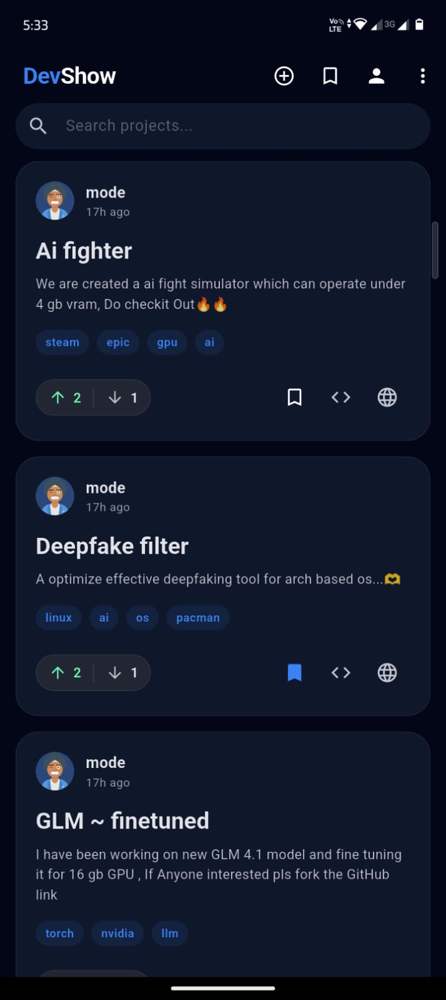
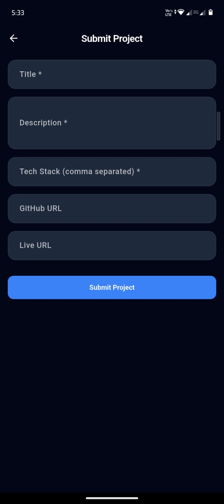
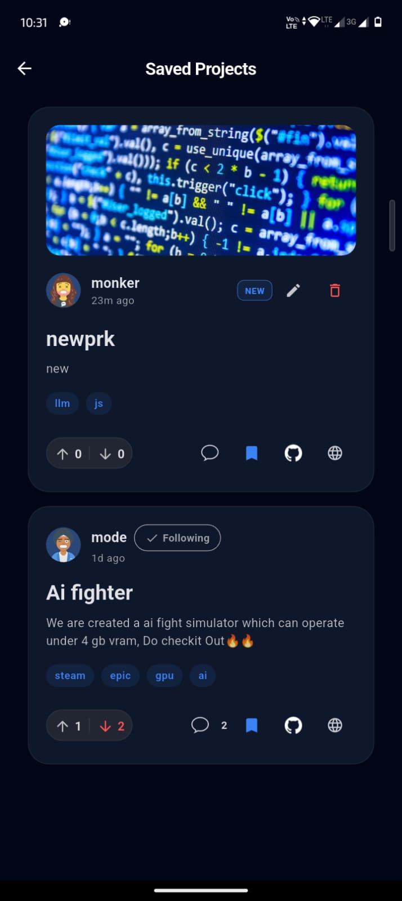
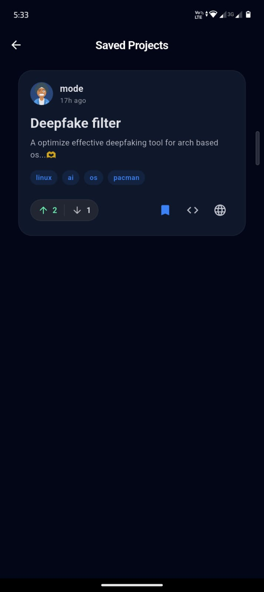

  

    
  

# DevShowcase (DevShow)

A modern developer showcase platform where builders **submit projects**, **explore feeds**, and **ship faster** with a clean mobile-first experience.
in-short a reddit for repos...

---
# Download APK

👉 Download DevShow.apk to validate handson (https://github.com/KSG-SHRI/dev_show/raw/main/DevShow.apk)

Enable "Install from unknown sources" on Android before installing.
## Demo

> Click to watch the app in action

[https://github.com/KSG-SHRI/dev_show/raw/main/demo.mp4](https://github.com/KSG-SHRI/dev_show/raw/main/demo.mp4)

---

## Screenshots

  
  
  
  

---

## ✨ Features

* **Authentication**

  * Email sign-up & login
  * Secure session handling
  * Email verification via Supabase

*  **Project Feed**

  * Browse submitted developer projects
  * Real-time updates
  * Clean card-based UI

* **Submit Projects**

  * Add project title, description, links
  * Upload screenshots
  * Instant publishing

*  **State Management**

  * Predictable & scalable state using Riverpod 

*  **Modern UI**

  * Material + custom widgets
  * Smooth navigation
  * Developer-centric UX

---

## How the App Works (High Level)

1. **User signs up / logs in**

   * Supabase Auth handles authentication
   * Session is cached locally

2. **Fetch project feed**

   * App requests project data from Supabase Postgres
   * Riverpod providers manage async state

3. **Submit a project**

   * User fills the form
   * Data is validated locally
   * Uploaded to Supabase DB + Storage

4. **UI reacts instantly**

   * Providers notify listeners
   * Feed updates without refresh
5. **Engagements**
   * Voting
   * Able to Save Projects
   * Repo & Product links
---

## Tech Stack

### Frontend

* **Flutter** (Dart)
* **Riverpod** – state management
* **Material UI** (flutter_animate too used)

### Backend (BaaS)

* **Supabase**

  * Auth (Email based)
  * Postgres Database
  * Storage (Image)
### Author
~ Shri Ganeshan K
